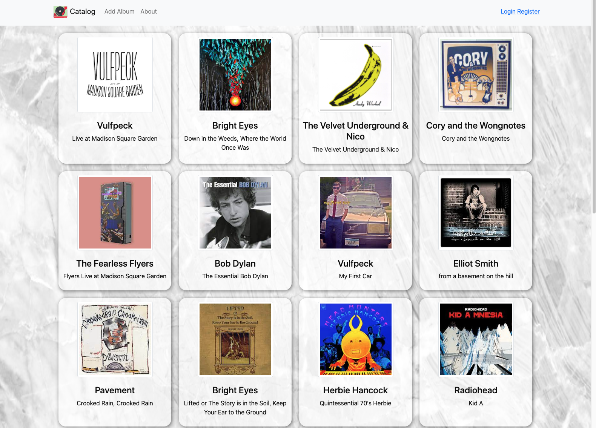
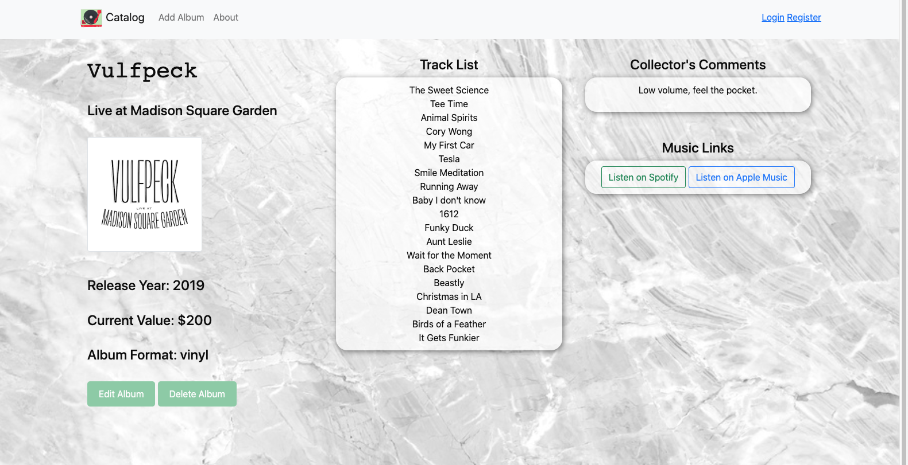
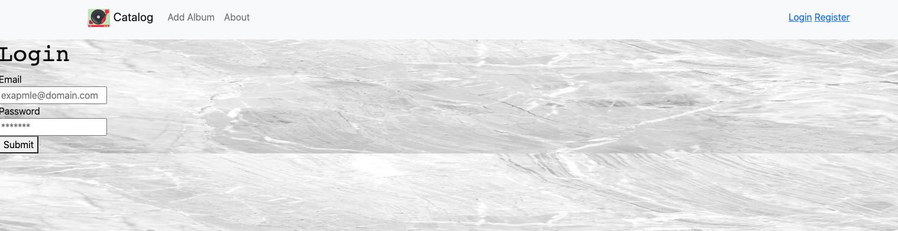
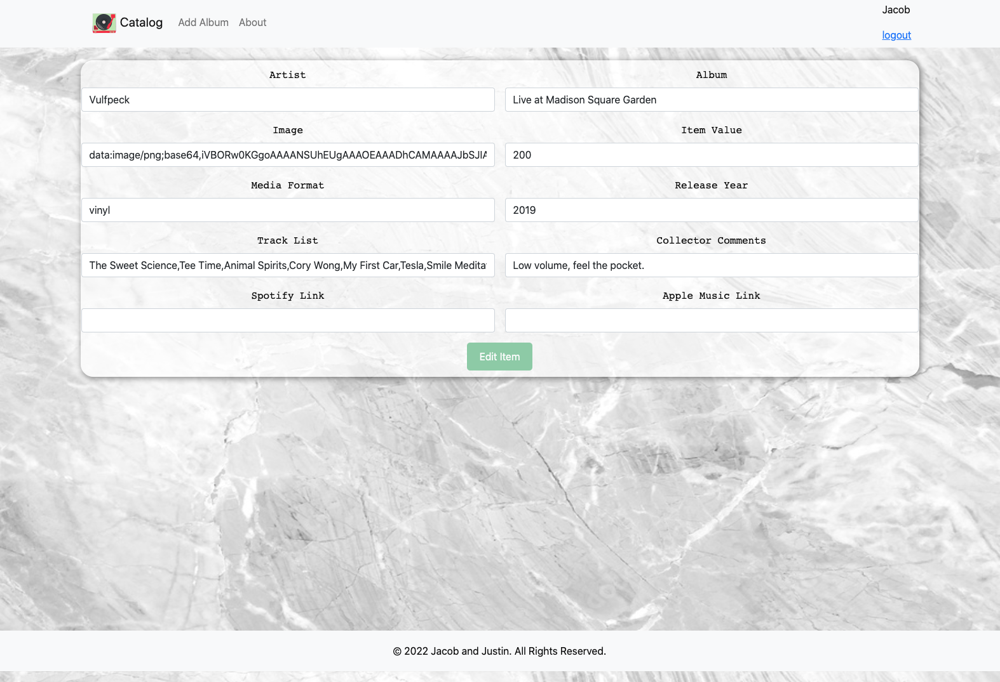

# TapeDisc

This site is meant to be used as a cataloging tools for collectors of Vinyl, CDs, and Cassette tapes.  Collectors can add their collections to the website to keep track of an extensive collection or just show off some cool items they've come across. Visitors to the site are welcome to peruse the Catalog no strings attached, if you feel inspired to share your collection just sign up and start adding it today!

# Images of the Site

# link to the site

https://mighty-springs-41330.herokuapp.com/catalog

# Tech Used

JavaScript, HTML, CSS, Bootstrap, Adobe Images, Github, Mongoose, Express, Node

# Next Steps

Future versions of this app will include a new page to show the entire entered catalog of individual users, there will also be added capabilities for users to leave comments or reveiws on other members collection items.   I would also like to implement a music related BLOG area. 

# References

https://www.discogs.com/

https://css-tricks.com/

https://stackoverflow.com/questions/7042340/error-cant-set-headers-after-they-are-sent-to-the-client

