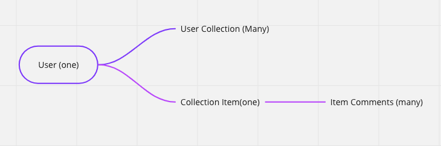
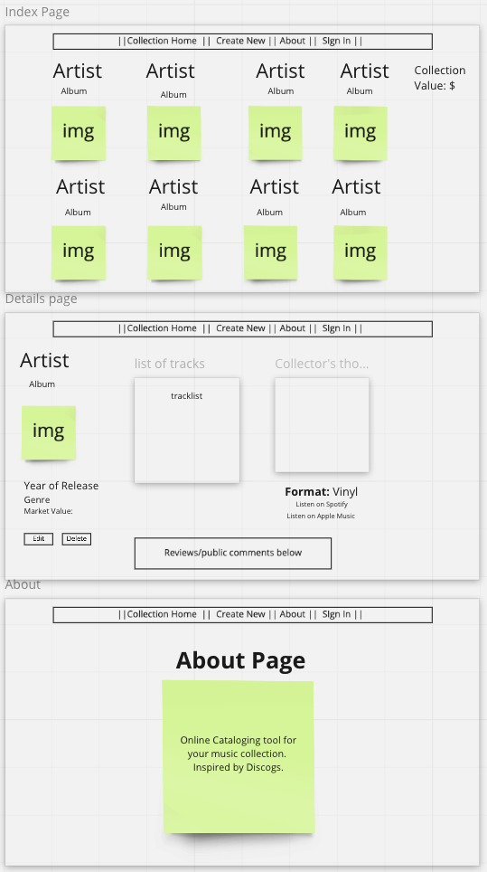

# Music Collection Cataloger

This site is meant to be used as a cataloging tools for collectors of Vinyl, CDs, and Cassette tapes.  Collectors can add their collections to the website to keep track of an extensive collection or just show off some cool items they've come across. Think Discogs meets social media. 

# Project Plan

In this Project Jacob and I will be building a Full CRUD express application. When buildling out our application we will divide respobsiblities as follows.  Directories and files Justin: Config/db.connections, Controllers, Server.js, and Models/.  Directories and files Jacob: /views including ejs files and partials/ public/styles main.css.  Jacob will take the lead on styling methods based on wireframes with Justin consulting along the way. Justin will setup the github, and mongoDB with sharing permissions. 

# Database Models planning

* Catalog Schema atrributes: 

ablum: string
artist: string
image: string
item value: number
media format: string
year of release: string
tracklist: array of strings
Collector Comments: string
spotify link: string
apple music link: string

* Review Schema (review will be referenced to Catalog)
rating: number
content: string
(mongoose catalog ref)

User will be stretch based on User Authenitcation capability: 

* User Schema:

name: string
email: string

# User Story

Our website is going to be a resource for music media collectors to catalog their collections, provide write ups, estimate collection values, and view the collections of others.  Users will be able to create, read, update, and delete items from their collections. They will also be able to comment on individual collections of others.

# Wireframe

# MVP

* Our Minimum Viable Product Goals: 

 Users should have full CRUD controls to Create, Read, Update, Delete items from their music collections, and leave reviews of individual items. 

* Index Page Include: 

 Artist
 Album Title
 Image of album cover as clickable link to details page

* Details page include: 

 Tracklist
 Optional review
 Approximate market Value
 Link to edit the item
 Review by Owner Part (of initial collection creation)
 Format: Vinyl, cassette, CD
 Year of release
 Genre
 Delete button to remove item from Catalog
 Links to album on Popular streaming services
 Basic styling with flex box and grid

# Stretch

User Authenication
Sass Styling
organize collections alphabettically or by Genre
Music Blog
Gear Section: For musicians to catalog and submit write ups about their gear purchases.

# References

https://www.discogs.com/
